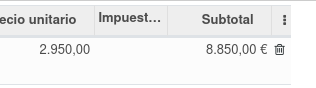
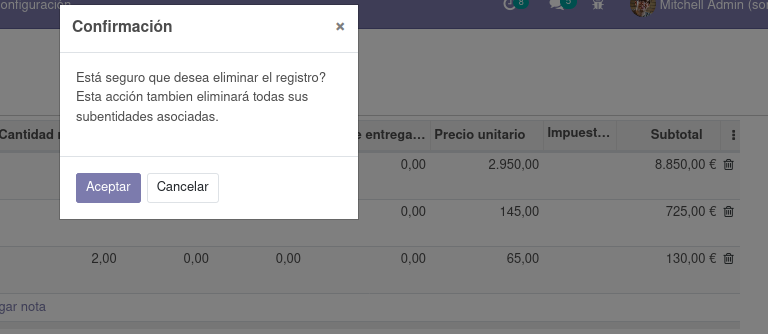

# Delete after confirm message field widget

Ask for confirmation before removing any record of an one2many field

## 👩‍💻 Usage
```xml
   <field name="myfield_ids" widget="delete_confirm_one2many"/>
```

Next click on trash icon

  

### Result

Click on the button over the table to add conditions. It uses the same Control Panel of the paginator component.



### Known issues
Hardcoded message confirmation in dialogue.
Passing it as keys in the context variable would be the best solution.
```xml
   <field name="myfield_ids" widget="delete_confirm_one2many" context="{'delete_confirm_dialog_title': 'My Title', 'delete_confirm_dialog_message': 'My Message'}"/>
``` 

## 👏 Contributing

Pull requests and 🌟 stars are always welcome.
For major changes, please open an issue first to discuss what you would like to change.

## 📩 Contact

racielperdomo1993@gmail.com

Twitter @Raikiri93

Linkedin /in/rpgomez

